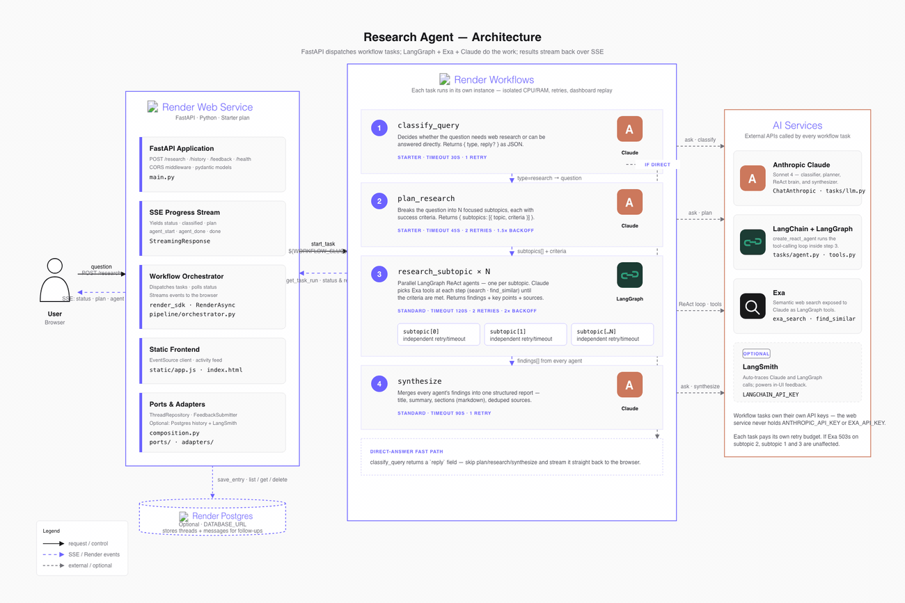

<div align="center">

# Research Agent

A real-time research assistant that combines **Render Workflows** for parallel orchestration with **LangGraph + Exa + Claude** for the actual research. Ask a question and watch it get classified, planned, researched in parallel, and synthesized into a sourced report — streamed live to the browser.

<p>
  <a href="https://render.com/deploy?repo=https://github.com/ojusave/render-workflows-exa-langchain">
    
  </a>
</p>

<p>
  <a href="https://render.com">
    
  </a>
  <a href="https://www.langchain.com">
    
  </a>
  <a href="https://exa.ai">
    
  </a>
  <a href="https://discord.gg/gvC7ceS9YS">
    
  </a>
</p>

</div>

## What This Demo Shows

This repo demonstrates how to build agentic research applications using:

| Platform | Role |
| --- | --- |
| **[Render Workflows](https://render.com/docs/workflows)** | Orchestrates the four research stages as isolated tasks with their own retries, timeouts, and dashboard replay |
| **[LangChain + LangGraph](https://www.langchain.com)** | Runs the per-subtopic ReAct loop — Claude picks tools, observes results, decides when to stop |
| **[Exa](https://exa.ai)** | Semantic web search, exposed to the agent as LangGraph tools (`exa_search`, `find_similar`) |
| **[Anthropic Claude](https://www.anthropic.com)** | The brain — classifier, planner, ReAct agent, and synthesizer |
| **[Render Web Services](https://render.com/docs/web-services)** | Hosts the FastAPI app, streams SSE progress, serves the UI |
| **[Render Postgres](https://render.com/docs/databases)** *(optional)* | Stores threaded research history for follow-up queries |

## Architecture



### How It Works

1. **Browser** posts a question to the **FastAPI web service** on Render
2. **FastAPI** streams progress via SSE and dispatches four kinds of work to **Render Workflows**
3. **Render Workflows** runs each stage as its own task with isolated CPU, retries, and timeout:

| Render Workflow Task | What It Does | Powered By |
| --- | --- | --- |
| `classify_query` | Decides whether the question needs web research or can be answered directly. Direct answers short-circuit the rest of the pipeline. | Claude |
| `plan_research` | Breaks the question into focused subtopics, each with success criteria. | Claude |
| `research_subtopic × N` | Parallel fan-out — one LangGraph ReAct agent per subtopic. Each agent searches with Exa until the criteria are met. | LangGraph + Exa + Claude |
| `synthesize` | Merges every agent's findings into one structured report with title, summary, sections, and deduped sources. | Claude |

4. Results stream back to the browser as named SSE events (`status`, `classified`, `plan`, `agent_start`, `agent_done`, `done`)
5. *(Optional)* If `DATABASE_URL` is set, the conversation persists as a thread you can reopen and follow up on

The pattern is **thin web, fat tasks**: FastAPI only dispatches and polls — no LangGraph or Claude calls happen in the request path. You can change agent prompts or tools without redeploying the API.

## Quick Start

### Prerequisites

- [Render account](https://dashboard.render.com/register?utm_source=github&utm_medium=referral&utm_campaign=ojus_demos&utm_content=readme_link) (free tier works)
- [Anthropic API key](https://console.anthropic.com/)
- [Exa API key](https://exa.ai/)

### Deploy

1. Click **Deploy to Render** above
2. You'll be prompted for `RENDER_API_KEY` — [get one here](https://render.com/docs/api#1-create-an-api-key)

3. Create the Workflow service manually:
   - Go to [Render Dashboard](https://dashboard.render.com) → **New** → **Workflow**
   - Connect this repository
   - Build command: `pip install -r requirements.txt`
   - Start command: `python -m tasks`
   - Name: `research-agent-workflow` (must match `WORKFLOW_SLUG` on the web service)
   - Env vars: `ANTHROPIC_API_KEY`, `EXA_API_KEY`, `PYTHON_VERSION=3.12.3`

4. Open the web service URL and ask a research question.

### Optional Integrations

| Add | How | Enables |
| --- | --- | --- |
| **Threaded history** | Create a Render PostgreSQL DB, set its Internal URL as `DATABASE_URL` on the web service | Sidebar of past threads, follow-up queries with prior context |
| **LangSmith tracing** | Set `LANGCHAIN_API_KEY` on **both** services | Auto-traced Claude + LangGraph calls, thumbs-up/down feedback in the UI |

## Configuration

| Variable | Where | Default | Description |
|---|---|---|---|
| `RENDER_API_KEY` | Web | required | Triggers workflow tasks |
| `WORKFLOW_SLUG` | Web | `research-agent-workflow` | Must match workflow service name |
| `DATABASE_URL` | Web | optional | PostgreSQL for thread history |
| `LANGCHAIN_API_KEY` | Both | optional | LangSmith tracing + feedback |
| `ANTHROPIC_API_KEY` | Workflow | required | Claude API key |
| `EXA_API_KEY` | Workflow | required | Exa semantic search |
| `ANTHROPIC_MODEL` | Workflow | `claude-sonnet-4-20250514` | Claude model |
| `AGENT_TEMPERATURE` | Workflow | `0.3` | LLM temperature |

## API

- **`POST /research`** — SSE stream. Body `{ "question": "...", "thread_id"?: "..." }`. Events: `status`, `classified`, `plan`, `agent_start`, `agent_done`, `direct_answer`, `done`, `error`.
- **`GET /history`** · **`GET /history/:id`** · **`DELETE /history/:id`** — JSON envelope `{ data, error, meta }`
- **`POST /feedback`** — `{ "run_id": "...", "score": 1 | -1 }`
- **`GET /health`** — liveness

Example:

```bash
curl -N -X POST "https://YOUR_SERVICE.onrender.com/research" \
  -H "Content-Type: application/json" \
  -d '{"question":"What are the main tradeoffs between RAG and fine-tuning?"}'
```

## Project Structure

```
main.py                FastAPI web service
composition.py         Wires ports to adapters
pipeline/
  orchestrator.py      Dispatch tasks, poll, stream SSE
  history.py           Postgres threaded history (optional)
  tracking.py          LangSmith pipeline run lifecycle (optional)
tasks/
  __main__.py          Workflow entry point (python -m tasks)
  classify.py          classify_query task
  plan.py              plan_research task
  research_agent.py    research_subtopic task (wraps LangGraph agent)
  synthesize.py        synthesize task
  agent.py             LangGraph ReAct agent
  tools.py             Exa tools
  llm.py               Shared ChatAnthropic model
ports/ · adapters/     ThreadRepository + FeedbackSubmitter (hex layout)
shared/api_envelope.py JSON response envelope helpers
static/                Single-page UI (index.html · app.js · api-client.js)
static/architecture.html  Source for the architecture diagram above
render.yaml            Render Blueprint
```

## Community

Questions about Render, workflows, or a stuck deploy: join the [Render Developers Discord](https://discord.gg/gvC7ceS9YS).

## License

[MIT](LICENSE)
